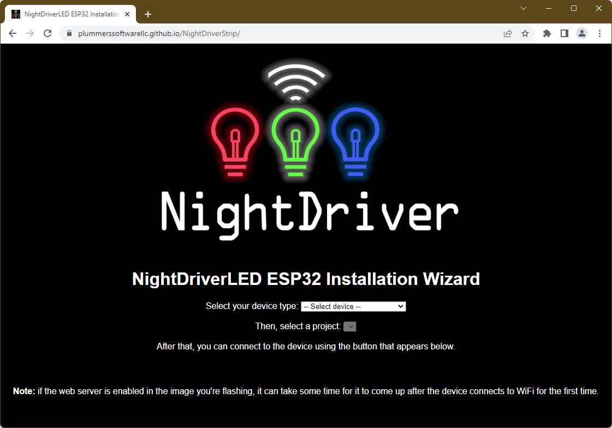

# NightDriverStrip

DEVELOPERS WANTED!  We are searching for talented React and C++ developers to help out on this project.  Check out the code and if you're interested, contact <davepl@davepl.com>.


<!-- markdownlint-disable MD033 /no-inline-html -->


<!-- markdownlint-disable-next-line MD036 /no-emphasis-as-heading -->
_Davepl, 9/19/2021_

- See [Discussions](http://github.com/PlummersSoftwareLLC/NightDriverStrip/discussions) for questions and comments.
- See source code and [COPYING.txt](COPYING.txt) for detailed technical and licensing information including versions.

## What NightDriverStrip is

NightDriverStrip is a source code package for building a flash program that you upload to the [ESP32 microcontroller](https://en.wikipedia.org/wiki/ESP32). It can drive up to 8 channels of WS2812B style LEDs connected to the chip pins and display fancy colors and patterns and designs on them. There are numerous effects built in that can be configured to be shown on the LED strip, including audio/music/beat-reactive effects for modules equipped with a microphone. It can also optionally receive color data for the LEDs in a simple LZ-compressed (or noncompressed) format over a TCP/IP socket that is opened by default on port 49152. The ESP32 keeps its clock in sync using NTP.

More recently, a web installer has been added to the project with which most of the NightDriver projects can be flashed on supported devices, using nothing but a web browser. Please refer to the section called [Using the Web Installer](#using-the-web-installer) if this is how you'd like to get started.

## Adding new effects

To add new effects, you:

1. Derive from `LEDStripEffect` (or an existing effect class) and the good stuff happens in the only important function, `Draw()`.
Check out what the built in effects do, but in short you're basically drawing into an array of CRGB objects that each represent a 24-bit color triplet. Once you're done, the CRGB array is sent to the LEDs and you are asked for the next frame immediately. Your draw method should take somewhere around 30ms, ideally, and should `delay()` to sleep for the balance if it's quicker. You **can** draw repeatedly basically in a busy loop, but its not needed.
2. Add an effect number `#define` for your effect to `effects.h`. Make sure it's not already used by another effect!
3. Add your class to the effect list created in the `LoadEffectFactories()` function in `effects.cpp` (under your build configuration section, like `DEMO`). The `ADD_EFFECT()` macro expects the effect number and type name of your new effect as parameters. Any additional parameters are passed to the effect's constructor when it's created.

There is a global `EffectManager` instance that first creates the effect table from a JSON file on SPIFFS, if present. Then it adds any other effects that are registered in `LoadEffectFactories()` but not included in the JSON file. It then rotates amongst those effects at a rate controlled by `DEFAULT_EFFECT_INTERVAL`. Effects are not notified when they go active or not, they're just asked to draw when needed.

Each channel of LEDs has an `LEDStripGfx` instance associated with it. `_GFX[0]` is the `LEDStripGfx` associated with `LED_PIN0`, and so on. You can get the LED buffer of Pin0 by calling `_GFX[0]->leds()`, and it will contain `_GFX[0]->GetLEDCount` pixels. You can draw into the buffer without ever touching the raw bytes by calling `fill_solid`, `fill_rainbow`, `setPixel`, and other drawing functions.

The simplest configuration, `DEMO`, assumes you have a single meter strip of 144 LEDs and a power supply connected to your ESP32. It boots up, finds a single `RainbowFillEffect` in the `LoadEffectFactories()` function, and repeatedly calls its `Draw()` method to update the CRGB array before sending it out to the LEDs. If working correctly it should draw a scrolling rainbow palette on your LED strip.

Concerning JSON peristence: the effects table is persisted to a JSON file on SPIFFS at regular intervals, to retain the state of effects (and in fact the whole effect list) across reboots. This is largely in preparation for future updates to NightDriverStrip, where the composition of the effect list configuration of individual effects can be changed using the device web application. The API endpoints to facilitate this are already available and ready for use (see [Device web UI and API](#device-web-ui-and-api), below.)

This makes that an override of `SerializeToJSON()` and a corresponding deserializing constructor must be provided for effects that need (or want) to persist more than the friendly name and effect number. Those two properties are (de)serialized from/to JSON by `LEDStripEffect` by default.

## Using the Web Installer

A web application has been made available that can be used to install the majority of NightDriver projects on supported devices. This will allow you to quickly flash a project on your ESP32 device, have it connect to WiFi and start using it without immediately having to work with the source code.

Note that the installer requires a browser that supports Web Serial. At the time of writing, browsers that include such support are recent versions of Chrome, Edge and Opera.

To use the installer, follow these steps:

1. Connect your device to your computer with a USB cable.

2. Navigate to the following URL in your browser: <https://plummerssoftwarellc.github.io/NightDriverStrip>. It should then show a screen that looks like this:
   

3. Select your device (like "M5StickC Plus") from the drop-down list. A second drop-down with supported projects on that device will then appear.

4. Select the project you want to flash in the second drop-down. When you do, a CONNECT button will appear below it.

5. Click the CONNECT button. A dialog will apear asking you to select a serial port. Depending on your system, it may show only one or a list of them. In case multiple are shown, it'll generally be the one plainly called "USB Serial Port (COMn)". Select the correct port and click Connect.

6. A new dialog will show. One of the options it offers is "INSTALL &lt;project&gt; FOR &lt;device&gt;". Click that option. You will be asked to confirm you want to flash the device. Click INSTALL.

7. A dialog will appear showing you the progress of the installation. Usually, this will take about 2 minutes. When flashing has completed, click NEXT.

8. If your device supports WiFi, you will now be asked for the WiFi connection information. Select/enter your SSID and password. Click CONNECT. In some cases, the WiFi connection dialog appears again after a successful connection was actually made. In that case, click SKIP.

9. Now, a dialog will appear that will show the details of the project you flashed. It will also provide options to flash again, visit the device's web application, change the WiFi settings, and show the device's logs & console. Note that if you flashed a device image that includes a web application, it may take a minute or so to come up after the connection to the WiFi network has been made.

The images included in the installer are built using the current state of the source code in this repository. If there's anything you'd like to change in (the configuration of) the project you want to use, then it is time to move to the next stage and start interacting with the source code itself.

## Device web UI and API

On devices with WiFi, NightDriverStrip can start a webserver that hosts the web UI that is part of the project. It can be used to view and change what effect is running, and get live performance statistics of the device.

When the device is started with the webserver enabled, the web UI can be accessed by opening a web browser and typing the IP address of your device in the address bar. Once loaded, the icons at the left of the screen can be used to toggle views within the UI on and off.

More information about the web UI can be found [in its own README.md](site/README.md).

Besides the web UI, the webserver also publishes a REST-like API. More information about it is available in [REST_API.md](./REST_API.md).

## Getting Started with the Source Code

I recommend you do the following:

- Copy include/secrets.example.h to include/secrets.h; Set your WiFi SSID and password in include/secrets.h.
- Build the source code. In particular, build the `DEMO` configuration. Some pointers on what's needed to do this can be found [below](#build-pointers).
- Upload the resultant binary to the ESP32
- Connect PIN5 and GND and 5V of a WS2812B strip to the ESP32
- Provide an adequate power source for the LEDs and ESP32
- Enjoy the pretty lights
- Start enabling features in the `globals.h` or platformio.ini file like WiFi and WebServer. See [Feature Defines](#feature-defines) below.
- Connect to the ESP32's web user interface with a browser to its IP address

## Wifi Setup

Ensure your WiFi SSID and password are set in include/secrets.h.<br/>
Please do make sure you set them in include/secrets.h, NOT in include/secrets.example.h!

Enable WiFi by setting the ENABLE_WIFI define to 1 in globals.h

```C++
#define ENABLE_WIFI 1
```

This can also be configured in the platformio.ini file, as described in the [Feature Defines](#feature-defines) section below.

## File system

To build and upload the file system that can be used by effects (although currently none do), you will need to build and upload the SPIFFS image to your board's flash using platformio. You can do this using the platformio user interface, or using the pio command line tool:

```ShellConsole
pio run --target buildfs --environment <project name>
pio run --target uploadfs --environment <project name>
```

## Tools

This repository includes a number of scrips to perform various tasks during or after building projects. They are included in the [`tools`](tools) directory. Please note that the scripts expect to be started from the project's main directory. So, using:

```shell
tools/buddybuild.sh
```

Instead of:

```shell
cd tools
./buddybuild.sh
```

## Sample Parts (Plummer's Software LLC Amazon Affiliate Links)

- BTF-Lighting WS2812B Strip, 144 pixels per meter, white: [Amazon.com](https://amzn.to/3CtZW2g)
- BTF-Lighting WS2812B Strip, 144 pixels per meter, black: [Amazon.com](https://amzn.to/39ljqcO)
- MakerFocus ESP32 Module with 8M Flash (not PSRAM) and built-in blue OLED: [Amazon](https://amzn.to/3ApdF9H)
- M5StickCPlus ESP32 Module with built-in LCD, Mic, buttons, battery, PSRAM, and more: [Amazon.com](https://amzn.to/3CrvCFh)
- 16x16 LED Matrix panels (3 per Spectrum Analyzer) [Amazon.com](https://amzn.to/3ABs5DK)
- Infinity Mirror for use with the MAGICMIRROR config: [Amazon.com](https://amzn.to/3lEZo2D)
- Super-handy breakout board for ESP32-DevKitC: [Amazon.com](https://amzn.to/3nKX7Wt)

Full Disclosure: As an Amazon Associate, PlummersSoftwareLLC earns commission from qualifying purchases. It's not added to the purchase price, and does not increase your cost at all. Plus, all 2021 profits from the Dave's Garage Channel, which includes these sales, will go to the UW Autism Center.

## Bonus Exercise

Write something simple to send color data to the socket. The format is very basic: which channel, how many LEDs you're drawing, when to draw it, and the color data itself. You can send uncompressed data with a zero timestamp as long as you send the correct header before your data, which is very simple. Data with a zero timestamp will just be drawn immediately with no buffering.

| BYTES   | FUNCTION  |                                                                               |
| ------- | --------- | ----------------------------------------------------------------------------- |
| 0, 1    | CommandID | _(Set it to 3, which is `WIFI_COMMAND_PIXELDATA64`)_                          |
| 2, 3    | ChannelID | _(Set it to 1 for single channel, though 0 works too for historical reasons)_ |
| 4 - 7   | Length    | _(Number of 24-bit `PIXELS` being set)_                                       |
| 8 - 15  | Seconds   | _(Set it to 0)_                                                               |
| 16 - 24 | Micros    | _(Set it to 0)_                                                               |
| 25+     | RGB       | _(24-bit RGB color data, one per `PIXEL` specified in Length above)_          |

If built with `ENABLE_WIFI` and `INCOMING_WIFI_ENABLED`, if the chip is able to get a WiFi connection and DHCP address it will open a socket on port 49152 and wait for packets formed as described above.

## Super Bonus Exercise

Generate a series of 24 frames per second (or 30 if under 500 LEDs) and set the timestamp to "Now" plus 1/2 a second. Send them to the chip over WiFi and they will be drawn 1/2 second from now in a steady stream as the timestamps you gave each packet come due.

## Contributing, and the BlinkenPerBit Metric

Rather than produce a complex set of guidelines, here's what I hope open-source collaboration will bring to the project: that folks will add important features and fix defects and shortcomings in the code. When they're adding features, they'll do it in a way consistent with the way things are done in the existing code. They resist the urge to rearchitect and rewrite everything in their own image and instead put their efforts towards maximizing functional improvement while reducing source code thrash and change.

Let's consider the inconsistent naming, which should be fixed. Some is camelCase, some is pszHungarian, and so on, depending on the source. I'd prefer it were all updated to a single standard TBD. Until the TBD is determined, I lean towards [the Win32 standard](https://docs.microsoft.com/en-us/windows/win32/stg/coding-style-conventions?redirectedfrom=MSDN).

When working in a function, work in the style of the function. When working on a class, work in the style of the class. When working on a file, work in the style of the file. If those are inconsistent, do whatever minimizes changes. Stylistic changes should only be introduced after discussion in the group, and generally should entain owning that style change across the entire project.

Next, let's consider `#define`s to control the build. There may be better and more elegant ways of doing things. There could be entire configuration platforms. But I'd prefer to keep it simple. And I define simplest to be "the least that an experienced C++ programmer needs to learn before being constructive with the code in question". I don't want to learn a new class library if I can avoid it!

A lifetime of coding has taught me to err on the side of simplicity, so please don't introduce variadic template constructs unless they demonstrably shrink the source code. Anything that grows the complexity AND length of the code should be suspect.

Add whatever you want and/or need to make your LED dreams come true. Fix my blunders. Fill in the obvious gaps in my knowledge. Whatever has the most blinken for the fewest bits get my vote. You only get so much additional cool blinken for every byte of code and program. That return is measured in BlinkenPerBit, the amount of blinking awesomeness the code adds divided by the impact on the source (and binary).

## Build Pointers

The project can be built using [PlatformIO](https://platformio.org/). There's a [PlatformIO IDE](https://platformio.org/platformio-ide) available, which is built on top of Visual Studio Code. Included in it are the command-line [PlatformIO Core](https://platformio.org/install/cli) tools. They can also be installed on their own if you prefer not using the IDE.

When either the IDE or Core are installed, NightDriverStrip can be built from a command shell by entering the project/repository directory and issuing the following command:

```ShellConsole
pio run -e demo
```

This will build the `demo` config.

> If you get an error that `pio` is not found, you might need to [add it to your path](https://docs.platformio.org/en/stable/core/installation/shell-commands.html).

To build all available configurations, use the following command (this might take a while):

```ShellConsole
pio run
```

## Feature Defines

These defines enable the major features of NightDriverStrip. Define them in platformio.ini's build_flags or in globals.h.
Note: Some defines are board specific, this is noted below.

| Feature Define        | Description                                                        |
| --------------------- | ------------------------------------------------------------------ |
| ENABLE_WIFI           | Connect to WiFi                                                    |
| INCOMING_WIFI_ENABLED | Accepting incoming color data and commands                         |
| ENABLE_WEBSERVER      | Turn on the internal webserver                                     |
| TIME_BEFORE_LOCAL     | How many seconds before the lamp times out and shows local content |
| ENABLE_NTP            | Set the clock from the web                                         |
| ENABLE_OTA            | Accept over the air flash updates                                  |

| Hardware Specific | Description                                         | Supported Boards             |
| ----------------- | --------------------------------------------------- | ---------------------------- |
| USE_M5DISPLAY     | Enable stats display on built in LCD                | M5Stick-C and M5Stick-C Plus |
| USE_OLED          | Enable stats display on built in OLED               | Heltec Wifi Kit 32           |
| USE_LCD           | Enable stats display on external ILI9341 LCD        | Wrover32                     |
| USE_TFTSPI        | Enable stats display on external TTGO LCD           | esp32dev                     |
| ENABLE_AUDIO      | Listen for audio from the microphone and process it | M5Stick-C and M5Stick-C Plus |
| ENABLE_REMOTE     | IR Remote Control                                   | Requires IR Hardware         |

example in platformio.ini (prefix the flags with `-D`, e.g. `ENABLE_WIFI=1` becomes `-DENABLE_WIFI=1`)

```INI
build_flags = -DENABLE_WIFI=1
```

example in globals.h:

```C++
#define ENABLE_WIFI 1
```

## Fetching things from the Internet

If you develop an effect that requires data that needs to be pulled in from the Internet then you can register a network reader function with the `NetworkReader` class, which is available via the `g_ptrNetworkReader` global variable. You can use either the `PatternSubscribers` or `PatternWeather` effects as sources of inspiration.

## Time It Takes To Build This Project

Time to build the SPECTRUM config (`pio run -e spectrum`). Assumes a clean build after everything has been installed and downloaded.

- AMD 3970 32-cores, 128GB, RAID SSD
  -> [davepl 09/19/2021] 12.93 seconds (Running Under WSL)

- AMD 5950X 16-cores, 64GB, SSD
  -> [davepl 09/19/2021] 16.90 seconds

- Apple MacBook Pro M1 MAX, 8+2 cores, 64GB, 4TB SSD
  -> [davepl 12/15/2021] 20.90 seconds

- Apple MacBook Air M2, 16GB, 256GB SSD
  -> [vaaski 02/28/2023] 56.17 seconds

- MacBook Pro 2020, 8 Cores 2.4GHz i9, 64GB, 4TB SSD
  -> [davepl 09/19/2021] 34.09 seconds

- Mac Mini, 4 Perf cores, 16GB
  -> [davepl 09/19/2021] 39.06 seconds

- Mac Pro, 6 cores, 3.5 GHz, 64GB, 1TB SSD
  -> [davepl 09/19/2021] 48.42 seconds

- Xeon Silver, 20 cores, 2.1GHz, 16GB VM
  -> [davepl 10/10/2022] 53.11 seconds

- Raspberry Pi 4, 64-bit Ubuntu LTS, 4 core, 4GB
  -> [davepl 09/23/2021] 6 min 25 seconds

- Jetson Nano 2G, 4 Core ARM A57
  -> [davepl 10/04/2021] 2 min 56 seconds
