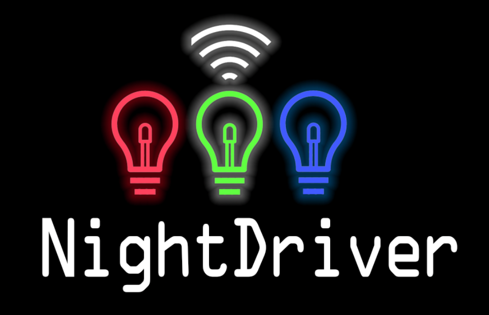

# NightDriverStrip




_Davepl, 9/19/2021_

- See [Discussions](http://github.com/PlummersSoftwareLLC/NightDriverStrip/discussions) for questions and comments.
- See source code and [COPYING.txt](COPYING.txt) for detailed technical and licensing information including versions.

## What NightDriverStrip is
NightDriverStrip is a source code package for building a flash program that you upload to the [ESP32 microcontroller](https://en.wikipedia.org/wiki/ESP32).  It can drive up to 8 channels of WS2812B style LEDs connected to the chip pins and display fancy colors and patterns and designs on them.  There are numerous effects built in that can be configured to be shown on the LED strip, including audio/music/beat-reactive effects for modules equipped with a microphone.  It can also optionally receive color data for the LEDs in a simple LZ-compressed (or noncompressed) format over a TCP/IP socket that is opened by default on port 49152.  The ESP32 keeps its clock in sync using NTP.

To add new effects, you derive from `LEDStripEffect` (or an existing effect class) and the good stuff happens in the only important function, `Draw()`.  Add your class to the `AllEffects` table in `effects.cpp` (under your build configuration section, like `DEMO`).  Check out what the built in effects do, but in short you're basically drawing into an array of CRGB objects that each represent a 24-bit color triplet.  Once you're done, the CRGB array is sent to the LEDs and you are asked for the next frame immediately.  Your draw method should take somewhere around 30ms, ideally, and should `delay()` to sleep for the balance if it's quicker. You **can** draw repeatedly basically in a busy loop, but its not needed.

There is a global `EffectsManager` instance that reads the `AllEffects` table in `effect.cpp` and then rotates amongst those effects at a rate controled by `DEFAULT_EFFEECT_INTERVAL`.  Effects are not notified when they go active or not, they're just asked to draw when needed.

Each channel of LEDs has an `LEDMatrixGfx` instance associated with it.  `_GFX[0]` is the `LEDMatrixGfx` associated with `LED_PIN0`, and so on.  You can get the LED buffer of Pin0 by calling `_GFX[0]->GetLEDBuffer()`, and it will contain `_GFX[0]->GetLEDCount` pixels.  You can draw into the buffer without ever touching the raw bytes by calling `fill_solid`, `fill_rainbow`, `setPixel`, and other drawing functions.

The simplest configuation, `DEMO`, assumes you have a single meter strip of 144 LEDs and a power supply connected to your ESP32.  It boots up, finds a single `PaletteEffect` object in the `AllEffects` table, and repeatedly calls its `Draw()` method to update the CRGB array before sending it out to the LEDs.  If working correctly it should draw a scrolling rainbow palette on your LED strip.

## Getting Started
I recommend you do the following:
- Build the source code.  In particular, build the `DEMO` configuration. Some pointers on what's needed to do this can be found [below](#build-pointers).
- Upload the resultant binary to the ESP32
- Connect PIN5 and GND and 5V of a WS2812B strip to the ESP32
- Provide an adequate power source for the LEDs and ESP32
- Enjoy the pretty lights
- Start enabling features in the `globals.h` file like WiFi and WebServer.  Set your WiFi SSID and password first.
- Connect to the ESP32's web user interface with a browser to its IP address

## Sample Parts (Plummer's Software LLC Amazon Affiliate Links)
- BTF-Lighting WS2812B Strip, 144 pixels per meter, white: https://amzn.to/3CtZW2g
- BTF-Lighting WS2812B Strip, 144 pixels per meter, black: https://amzn.to/39ljqcO
- MakerFocus ESP32 Module with 8M Flash (not PSRAM) and built-in blue TFT: https://amzn.to/3ApdF9H
- M5StickCPlus ESP32 Module with built-in OLED, Mic, buttons, battery, PSRAM, and more:  https://amzn.to/3CrvCFh
- 16x16 LED Matrix panels (3 per Spectrum Analyzer) https://amzn.to/3ABs5DK
- Infinity Mirror for use with the MAGICMIRROR config: https://amzn.to/3lEZo2D
- Super-handy breakout board for ESP32-DevKitC: https://amzn.to/3nKX7Wt

## Bonus Exercise
Write something simple to send color data to the socket.  The format is very basic: which channel, how many LEDs you're drawing, when to draw it, and the color data itself.  You can send uncompressed data with a zero timestamp as long as you send the correct header before your data, which is very simple.  Data with a zero timestamp will just be drawn immediately with no buffering.

| BYTES | FUNCTION | |
| - | - | - |
| 0,  1   | CommandID | _(Set it to 3, which is `WIFI_COMMAND_PIXELDATA64`)_ |
| 2,  3   | ChannelID | _(Set it to 1 for single channel, though 0 works too for historical reasons)_ |
| 4 - 7   | Length    | _(Number of 24-bit `PIXELS` being set)_ |
| 8 - 15  | Seconds   | _(Set it to 0)_ |
| 16 - 24 | Micros    | _(Set it to 0)_ |
| 25+     | RGB       | _(24-bit RGB color data, one per `PIXEL` specified in Length above)_ |

If built with `ENABLE_WIFI` and `INCOMING_WIFI_ENABLED`, if the chip is able to get a WiFi connection and DHCP address it will open a socket on port 49152 and wait for packets formed as described above.

## Super Bonus Exercise
Generate a series of 24 frames per second (or 30 if under 500 LEDs) and set the timestamp to "Now" plus 1/2 a second.  Send them to the chip over WiFi and they will be drawn 1/2 second from now in a steady stream as the timestamps you gave each packet come due.

## Contributing, and the BlinkenPerBit Metric
Rather than produce a complex set of guidelines, here's what I hope open-source collaboration will bring to the project: that folks will add important features and fix defects and shortcomings in the code.  When they're adding features, they'll do it in a way consistent with the way things are done in the existing code.  They resist the urge to rearchitect and rewrite everything in their own image and instead put their efforts towards maximizing functional improvement while reducing source code thrash and change.

Let's consider the inconsistent naming, which should be fixed.  Some is camelCase, some is pszHungarian, and so on, depending on the source. I'd prefer it were all updated to a single standard TBD.  Until the TBD is determined, I lean towards [the Win32 standard](https://docs.microsoft.com/en-us/windows/win32/stg/coding-style-conventions?redirectedfrom=MSDN).  

When working in a function, work in the style of the function.  When working on a class, work in the style of the class.  When working on a file, work in the style of the file.  If those are inconsistent, do whatever minimizes changes.  Stylistic changes should only be introduced after discussion in the group, and generally should entain owning that style change across the entire project.

Next, let's consider `#define`s to control the build.  There may be better and more elegant ways of doing things. There could be entire configuration platforms.  But I'd prefer to keep it simple.  And I define simplest to be "the least that an experienced C++ programmer needs to learn before being constructive with the code in question".  I don't want to learn a new class library if I can avoid it!

A lifetime of coding has taught me to err on the side of simplicity, so please don't introduce variadic template constructs unless they demonstrably shrink the source code.  Anything that grows the complexity AND length of the code should be suspect.

Add whatever you want and/or need to make your LED dreams come true.  Fix my blunders.  Fill in the obvious gaps in my knowledge.  Whatever has the most blinken for the fewest bits get my vote.  You only get so much additional cool blinken for every byte of code and program.  That return is measured in BlinkenPerBit, the amount of blinking awesomeness the code adds divided by the impact on the source (and binary).

## Build Pointers
The project can be built using [PlatformIO](https://platformio.org/). There's a [PlatformIO IDE](https://platformio.org/platformio-ide) available, which is built on top of Visual Studio Code. Included in it are the command-line [PlatformIO Core](https://platformio.org/install/cli) tools. They can also be installed on their own if you prefer not using the IDE.

When either the IDE or Core are installed, NightDriverStrip can be built from a command shell by entering the project/repository directory and issuing the following command:
```
pio run
```

This will build the DEMO config.

Note that the repository CI builds both the DEMO and SPECTRUM configurations. This can be done locally using this command:
```
pio run -e demo -e spectrum
```

## Time It Takes To Build This Project
Time to build the SPECTRUM config.  Assumes a clean build after everything has been installed and downloaded.

- AMD 3970 32-cores, 128GB, RAID SSD 
-> [davepl 09/19/2021] 12.93 seconds (Running Under WSL)

- AMD 5950X 16-cores, 64GB, SSD
-> [davepl 09/19/2021] 16.90 seconds

- MacBook Pro 2020, 8 Cores 2.4GHz i9, 64GB, 4TB SSD
-> [davepl 09/19/2021] 34.09 seconds

- Mac Mini, 4 Perf cores, 16GB
-> [davepl 09/19/2021] 39.06 seconds

- Mac Pro, 6 cores, 3.5 GHz, 64GB, 1TB SSD
-> [davepl 09/19/2021] 48.42 seconds

- Raspberry Pi 4, 64-bit Ubuntu LTS, 4 core, 4GB
-> [davepl 09/23/2021] 6 min 25 seconds

- Jetson Nano 2G, 4 Core ARM A57
-> [davepl 10/04/2021] 2 min 56 seconds
