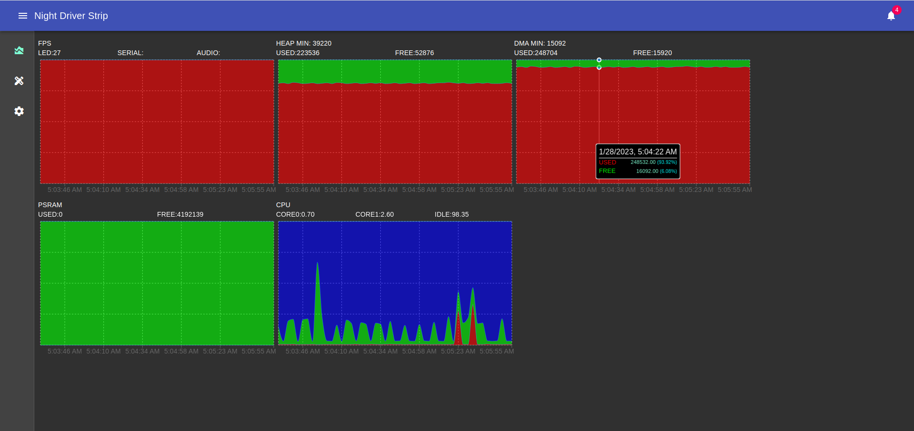
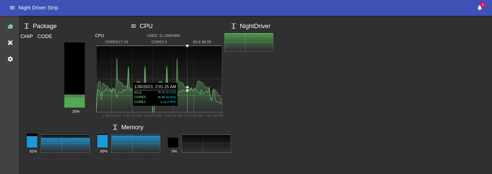

# NightDriverStrip Web Site

<!-- markdownlint-disable MD036 /no-emphasis-as-heading -->
_Louisr, 1/24/2023_

## Setup
In order to locally develop this site, you need to have the following requirements:
- Linux/WSL or Git Bash for windows
- nodejs v16+
- npm latest

With the requirements filled, open a bash terminal, go to the site folder and type `npm install`.

In order to test locally, you need to put the ip address in [site/src/espaddr.jsx](https://github.com/Louis-Riel/NightDriverStrip/blob/main/site/src/espaddr.jsx)

Once this is done, please run `npm run start`, open a browser tab and paste the address that running this command put on your clipboard.

Once local testing is done, flash the ESP and point your browser to it.

  

